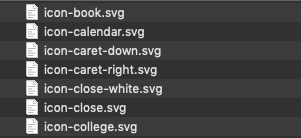
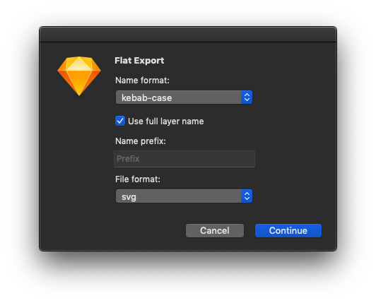

# Sketch Flat Export

## Purpose

This plugin lets you export your symbols and layers with manageable filenames into one folder, without needing to change your Sketch symbol nesting or naming conventions.

#### These Sketch symbols...

#### ...export to these files

## Usage

Download the <a download href="./flat-export.sketchplugin" >Sketch Plugin file</a>, and double click it, or move it to your plugins folder manually.

To use, press `⌃ Ctrl` + `⇧ Shift` + `E` to open the dialog.

## Parameters

### Name format
Choose between `kebab-case`, `snake_case` or `camelCase`

### Use full layer name
Uses the full layer name when exporting

e.g. The layer `Icon/Search` exports as: `icon-search.svg`.
When turned off, this same layer will export as: `search.svg`

### Prefix
Text to add to the beginning of the filename

e.g. `company-icon-search.svg`

### File format
Export as `svg`, `png`, or `jpg`

### Scale
(since v2.2.3)
Select export size `@1x`, `@2x` or `@3x`

